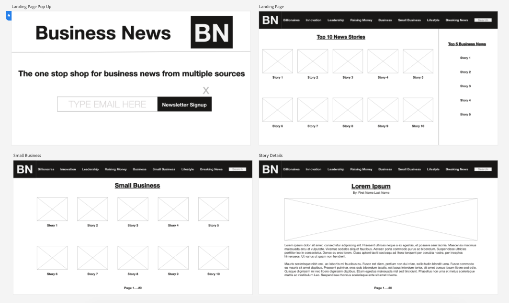
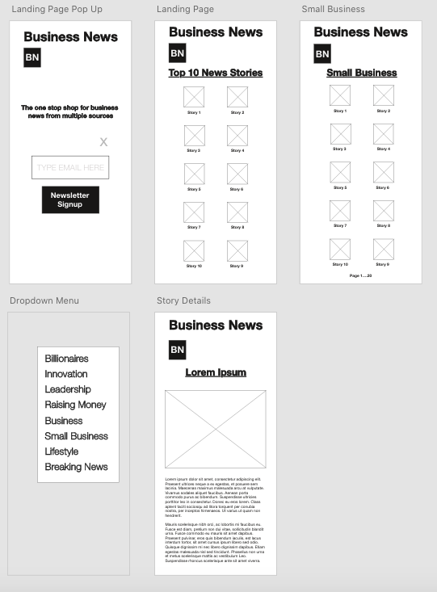

# BusinessNews

### Overview

**Business News** is the website for finding business news articles from various news sources all in one place.

**Forbes Coding Challenge Prompt**
Using any image API of your choice, or API that returns content with images:
Retrieve a list of at least 50 images and display them as thumbnails on a page
Paginate thumbnails by 10 thumbnails per page
When clicking on an image it should display in a modal.\
All images should be about a specific theme or based on a specific word.

**Technical Constraints**

- Built with html/js/css\
- May use pre-processors for css (but no frameworks, such as bootstrap)\
- May use whatever build tools desired\
- The application should work and run when executing `npm i && npm start` from its root directory\
- Vanilla JS (no frameworks, or libraries)\
- Take responsive design into consideration\
- Needs to work in Chrome\
- If applicable: Include instructions for running your unit tests

### Data Architecture

This section defines data architecture inclusive of site map.\

- Upon load the page will display top news based on page name as a search term.\
- There will be an option for the user to choose a specfic publication to drill down data.\
- When a user finds an article he or she would like to read, a simple click is all that is needed to return a page with the full article.

```

|__ Style/
      |__ Style.css
      |__ Business News Logo
|__ Pages/
      |__ Index.html
      |__ Billionaires.html
      |__ Innovation.html
      |__ Leadership.html
      |__ Raising Money.html
      |__ Business.html
      |__ Small Business.html
      |__ Lifestyle.html
      |__ BreakingNews.html
      |__ Sitemap.html
```

### Wireframes

#### Desktop View 1920 x 1080



Wireframe Link: https://xd.adobe.com/view/74ce5219-2b20-491b-96b5-3139f4ce30ac-219d/ \

a) Developer View\
b) Prototype (Mid-fi)\
c) Grid View

#### Mobile View iPhone



Wireframe Link: https://xd.adobe.com/view/503d272a-8620-418e-8f8d-3890f173d935-056e/ \

a) Developer View\
b) Prototype (Mid-fi)\
c) Grid View

### API

The API used for images is the NewsAPI. I will be extracting the images associated with the specific article. I will then allow the user to read the article after clicking on the image &/or Title.

Search criteria:

a) Keyword or phrase\
b) Date published\
c) Source name\
d) Source domain name\
e) Language

|   API   | Quality Docs? | Website              | Sample Query                                                                                           |
| :-----: | :-----------: | :------------------- | :----------------------------------------------------------------------------------------------------- |
| NewsAPI |      yes      | https://newsapi.org/ | http://newsapi.org/v2/everything?domains=wsj.com&apiKey=APIKEY                                         |
| NewsAPI |      yes      | https://newsapi.org/ | http://newsapi.org/v2/everything?q=bitcoin&from=2020-06-06&sortBy=publishedAt&apiKey=APIKEY            |
| NewsAPI |      yes      | https://newsapi.org/ | http://newsapi.org/v2/top-headlines?country=us&category=business&apiKey=APIKEY                         |
| NewsAPI |      yes      | https://newsapi.org/ | http://newsapi.org/v2/top-headlines?sources=techcrunch&apiKey=APIKEY                                   |
| NewsAPI |      yes      | https://newsapi.org/ | http://newsapi.org/v2/everything?q=apple&from=2020-07-05&to=2020-07-05&sortBy=popularity&apiKey=APIKEY |

### Technologies Used

- _AdobeXD_\
- _Draw.io_\ -_Visual Studio Code_

### Helper Functions

Use this section to document all helper functions– generic functions that can be reused in other applications.

|  Function  | Description                                |
| :--------: | :----------------------------------------- |
| Capitalize | _Lorem ipsum dolor sit amet, consectetur._ |

### Post-MVP

Use this section to document ideas you've had that would be fun (or necessary) for your Post-MVP. This will be helpful when you return to your project after graduation!

#### Post-MVP Goals

- _Add user account and auth capabilities._

### Code Showcase

Use this section to include a brief code snippet of functionality that you are proud of an a brief description

```
function reverse(string) {
	// here is the code to reverse a string of text
}
```

### Code Issues & Resolutions

Use this section to list of all major issues encountered and their resolution.

| Error                                                   | Resolution                                             |
| :------------------------------------------------------ | :----------------------------------------------------- |
| `app.js:34 Uncaught SyntaxError: Unexpected identifier` | Missing comma after first object in sources {} object. |

### Installation Instructions For Local Machine

### Link to deployed site (for quick reference while scrolling through readme file):

Netlify(front-end): ()
